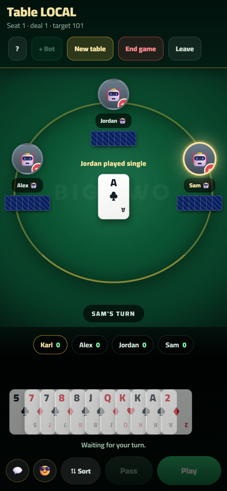

# Big Two 🃏

An online, mobile-first version of **Big Two** (锄大地 / Chinese poker). Play with
friends across the internet, or against bots offline. No build step, no
framework — just static files you can host anywhere.



---

## Features

- **Play anywhere** — create a table, share the 6-character code, and friends join instantly.
- **Offline bot mode** — no internet or backend required; play 1 human vs 3 bots.
- **Full Big Two rules** — singles, pairs, triplets and all five-card hands
  (straight, flush, full house, four-of-a-kind, straight flush), correct suit
  ranking, 3♦ opening, and pass-to-control flow.
- **Round & game scoring** — house-rule penalties, running totals, first to 101 loses.
- **Personal touches** — profile photo or emoji avatar, quick comments, and
  stickers that pop up on the table.
- **Made for phones** — safe-area aware, one-handed layout, smooth card animations,
  and it frames itself neatly on desktop too.

## Quick start (local)

You need [Node.js](https://nodejs.org) 18+.

```bash
npm start          # serves the game at http://localhost:5173
```

Open the URL on your computer or phone (same Wi-Fi) and hit **Play vs bots** —
no backend needed. To develop against a different port: `npm start 8080`.

Run the rules test suite (it simulates hundreds of full games):

```bash
npm test
```

## Project structure

```
bigtwo/
├─ public/                 ← everything that gets hosted
│  ├─ index.html           ← markup + screens
│  ├─ styles.css           ← design system + table styling (mobile-first)
│  ├─ engine.js            ← pure Big Two rules (no DOM) — the game's brain
│  ├─ app.js               ← UI, state, networking, bots
│  └─ assets/stickers/     ← sticker images
├─ test/engine.test.js     ← engine unit + full-game simulation tests
├─ supabase-schema.sql     ← optional online-play database schema
├─ serve.js                ← tiny local dev server
└─ package.json
```

The **rules live in `engine.js`** as pure functions, fully separated from the
UI. That is what makes them testable (`npm test`) and keeps `app.js` focused on
rendering and syncing.

## Deploying

It is a static site — host the **contents of `public/`** on any static host:

- **GitHub Pages** — push `public/` (or set Pages to serve from it) and you're live.
- **Netlify / Vercel / Render / Cloudflare Pages** — point the site at `public/`
  as the publish directory, no build command.

## Online multiplayer (optional)

Online play uses [Supabase](https://supabase.com) (a Postgres database with
realtime). If it isn't configured, the game silently falls back to local bot mode.

1. Create a free Supabase project.
2. In the SQL editor, run [`supabase-schema.sql`](./supabase-schema.sql).
3. In `public/app.js`, set your project values at the top:

   ```js
   const CONFIG = {
     SUPABASE_URL: 'https://YOUR-PROJECT.supabase.co',
     SUPABASE_ANON_KEY: 'YOUR-ANON-KEY',
   };
   ```

The `anon` key is meant to be public (it ships in the browser). See the security
note in the schema file about the intentionally-open row-level-security policies.

## How the game plays

- Cards rank **3 (low) → 2 (high)**; suits rank **♦ < ♣ < ♥ < ♠**.
- The holder of **3♦** opens the very first deal. After that, the previous
  round's winner leads.
- Beat the current play with a **stronger combo of the same size**, or pass. If
  everyone passes, the last player to play takes control and leads anything.
- Empty your hand to win the round. Everyone else scores penalty points for the
  cards they're holding (1–4 ×1, 5–9 ×2, 10–12 ×3, a full 13 = 39).
- When someone reaches **101**, the game ends and the **lowest total wins**.

Tap **?** in-game for the same rundown.

## Notes for maintainers

- **No dependencies to install** for the game itself — `npm` scripts only use Node's
  standard library. The Supabase client is loaded from a CDN in `index.html`.
- In an online room, one client (the host, or the lowest-seated human if the host
  leaves) drives the bots and finalizes rounds, so play never stalls.
- User-supplied values (names, avatars, stickers) are escaped/whitelisted before
  rendering — see `safeText` / `safeImg` in `app.js`.
